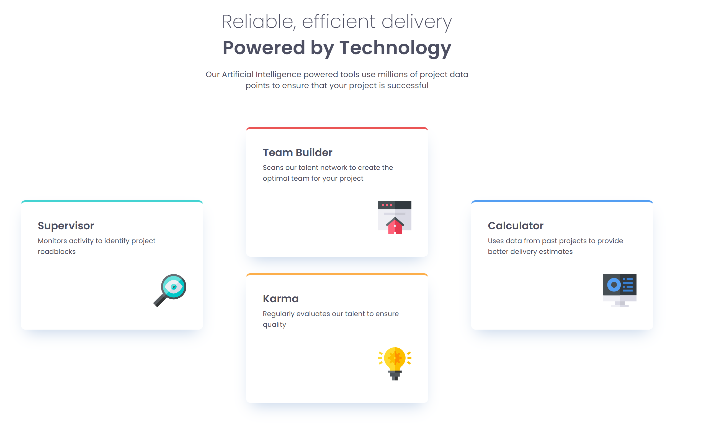
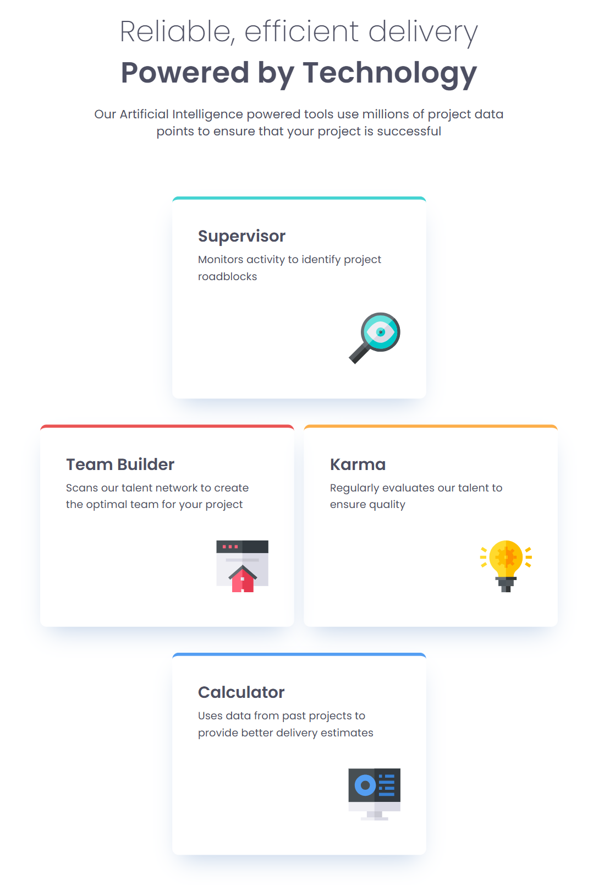
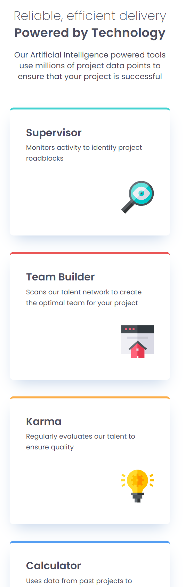

## Table of contents

- [Overview](#overview)
  - [The challenge](#the-challenge)
  - [Screenshot](#screenshot)
  - [Links](#links)
- [My process](#my-process)
  - [Built with](#built-with)
  - [What I learned](#what-i-learned)
- [Author](#author)

## Overview

### The challenge

Users should be able to:

- View the optimal layout for the site depending on their device's screen size

### Screenshot

Desktop Screen

Tablet Screen

Mobile Screen

### Links

- Solution URL: [https://github.com/ndurante90/four-card-feature]
- Live Site URL: [https://four-card-feature-eta-six.vercel.app/]

## My process

### Built with

- Semantic HTML5 markup
- CSS custom properties
- Flexbox
- Mobile-first workflow

### What I learned

Using a mix of percentaces and pixel properties to ensure that the layout is as close as possible to the one provided.
This for all the screen sizes.
I have learned to use flexbox for some cards and to remove it to others (based on media query used) to obtain the final result

## Author

- Frontend Mentor - [@ndurante90](https://www.frontendmentor.io/profile/ndurante90)
